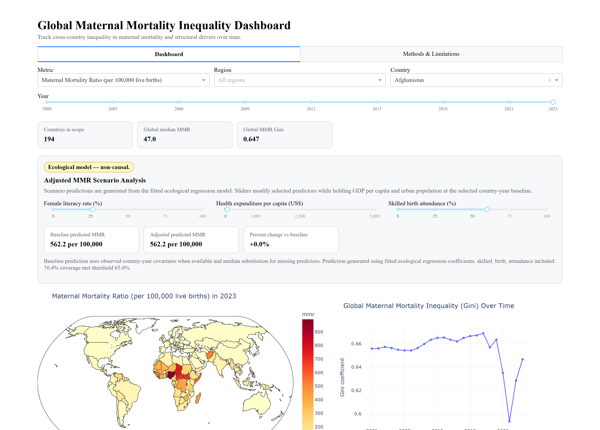
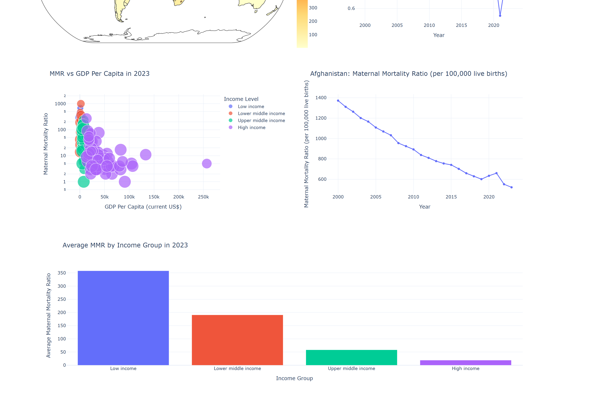
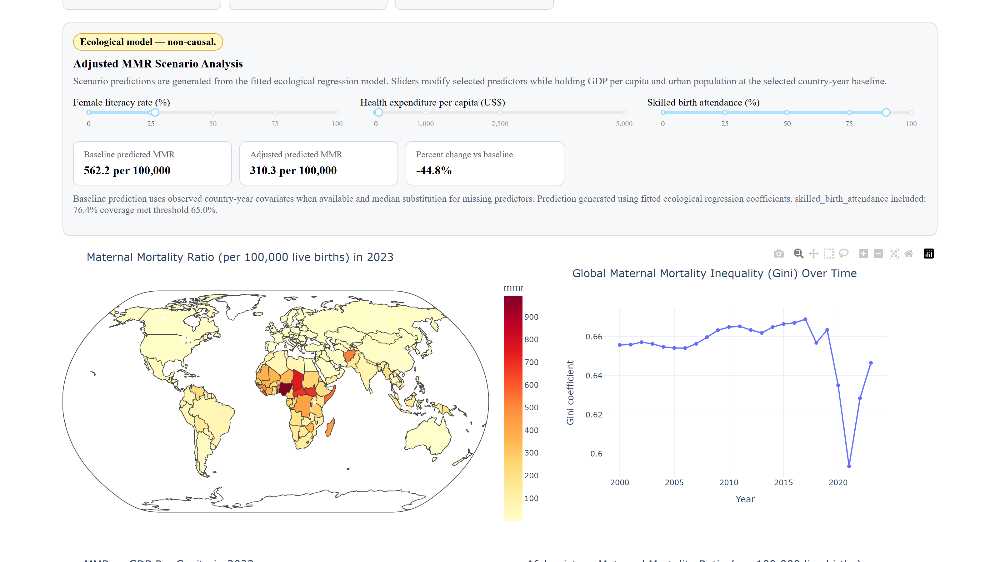
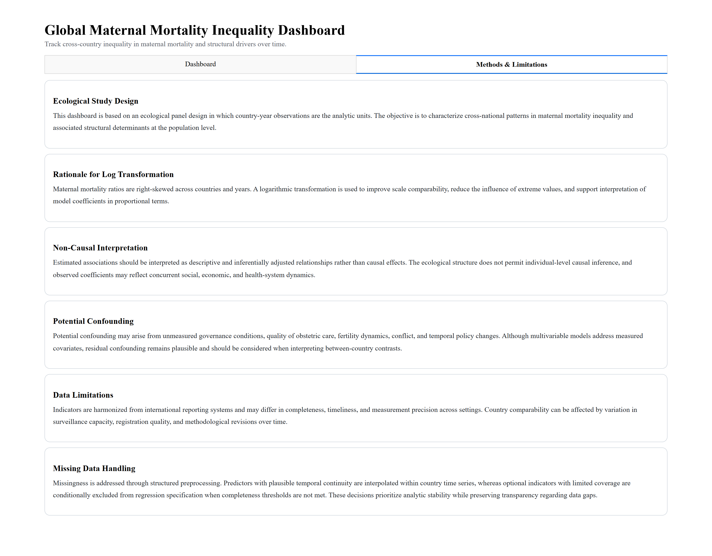
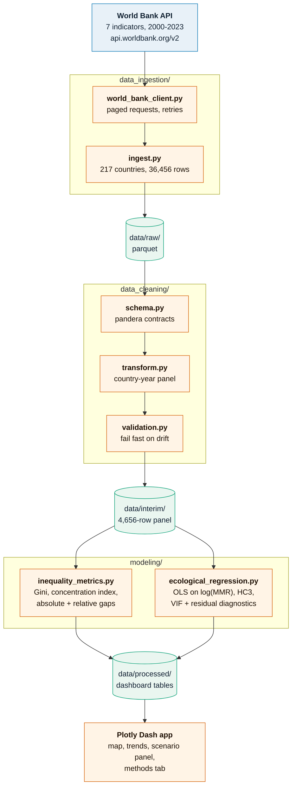

<h1 align="center">Global Maternal Mortality Inequality Dashboard</h1>

<p align="center">
  <strong>How unequally are maternal deaths distributed across the world, what explains the gap,<br>
  and is it actually closing?</strong>
</p>

<p align="center">
  
  
  
  
  
</p>

An end-to-end Python project that pulls seven maternal-health indicators from the
**World Bank API**, measures cross-country inequality in maternal mortality with
standard health-economics metrics, fits an ecological regression to identify
structural drivers, and serves the result as an interactive **Plotly Dash**
dashboard with a scenario simulator.

**194 countries · 2000–2023 · 36,456 raw observations · 2,823 modelled country-years**



---

## Three findings

### 1. Maternal mortality halved. Inequality barely moved.

| | 2000 | 2023 |
|---|---|---|
| Global mean MMR | 235.6 | **116.1** |
| Global median MMR | 71.5 | 47.0 |
| **Gini across countries** | 0.656 | **0.647** |
| 90th/10th percentile ratio | 72.8 | **88.2** |

The global burden fell by half, but the **Gini coefficient moved less than one
percentage point** — and by the p90/p10 measure the tails actually *diverged*.
Mortality fell nearly everywhere, so the distribution shifted down without
becoming meaningfully more equal.

### 2. A woman in a low-income country remains ~19× more likely to die

| Income group (2023) | Countries | Mean MMR | GDP per capita | Female secondary completion |
|---|---|---|---|---|
| Low income | 25 | **358.0** | $770 | **15.5%** |
| Lower middle | 47 | 190.8 | $2,456 | 40.4% |
| Upper middle | 58 | 58.4 | $7,952 | 69.9% |
| High income | 64 | **19.1** | $45,629 | 87.2% |

The **concentration index is −0.50**, confirming the burden is heavily
concentrated among poorer countries. The absolute gap has narrowed
substantially (797 → 339 deaths per 100,000) even as the relative ratio remains
enormous.


The gradient is monotonic across all four income groups. The per-country panel
shows individual trajectories — Afghanistan fell from 1,370 to 510 over the
window, a 63% reduction, while still ending far above the global median of 47.

### 3. The 2021 "improvement" in equity was rich countries getting worse

This is the finding the headline metrics hide, and the reason this dashboard
plots both arms of every ratio.

| Year | Low-income mean MMR | High-income mean MMR | Ratio | Gini |
|---|---|---|---|---|
| 2019 | 450.4 | 20.3 | 22.2× | 0.663 |
| 2020 | 428.0 | 26.4 | 16.2× | 0.635 |
| 2021 | 436.4 | **32.0** | **13.6×** | **0.594** |
| 2022 | 380.4 | 25.9 | 14.7× | 0.628 |
| 2023 | 358.0 | 19.1 | 18.7× | 0.647 |

Read the ratio alone and 2021 looks like the most equitable year in two decades.
It was not. **High-income maternal mortality rose 58%** (20.3 → 32.0) during the
pandemic while low-income mortality was roughly flat. The inequality gap closed
from the *denominator* side.

Individual high-income countries driving it, 2019 → 2021:

| Country | 2019 | 2021 |
|---|---|---|
| Cyprus | 13 | 98 |
| Kuwait | 7 | 75 |
| Oman | 14 | 74 |
| Bahamas | 82 | 174 |
| Uruguay | 16 | 49 |

*Caveat: several of these are small populations where MMR is volatile, and World
Bank figures are modelled estimates subject to revision. The direction is
consistent across the group, but individual country values should not be read as
precise counts.*



---

## What predicts maternal mortality

Ecological OLS on `log(MMR)`, HC3 robust standard errors, 2,823 country-year
observations across 153 countries, **R² = 0.725**.

| Predictor | Coefficient | Robust SE | p | Interpretation |
|---|---|---|---|---|
| **Skilled birth attendance** | −0.0199 | 0.0010 | 7e−82 | Each +1pp → **−2.0%** MMR |
| **Female literacy rate** | −0.0162 | 0.0009 | 8e−73 | Each +1pp → **−1.6%** MMR |
| log GDP per capita | −0.2287 | 0.0229 | 1e−23 | +1% GDP → −0.23% MMR |
| Health expenditure per capita | −0.00058 | 0.00005 | 2e−38 | +$100 → −5.6% MMR |
| Urban population % | −0.0018 | 0.0009 | **0.057** | **not significant** |

Two things stand out. **Urbanisation is the only predictor that fails
significance** — being city-dwelling does not itself protect mothers. And the two
strongest effects are not wealth but *service delivery and women's education*:
whether a trained attendant is present at birth, and whether women can read.

That distinction matters for policy. GDP is the hardest thing to change quickly;
skilled birth attendance is the most directly actionable.

All predictor VIFs sit between **2.15 and 4.61** — below the multicollinearity
threshold of 5 — so these estimates are not fighting each other for the same
variance. (The VIF table also reports the intercept at 82.3 and flags it; that is
expected and meaningless for a constant term, not a modelling problem.)

---

## The scenario simulator

The fitted coefficients drive a what-if panel: move female literacy, health
expenditure, or skilled birth attendance and see the model's adjusted prediction.



From the baseline shown above (Afghanistan 2023, predicted MMR 562), holding all
other predictors fixed:

| Change | Predicted MMR | Change |
|---|---|---|
| Skilled birth attendance 60% → 90% | 310 | **−44.9%** |
| Female literacy 15% → 60% | 271 | **−51.8%** |
| Health expenditure $30 → $200 | 510 | −9.4% |

Because the model is log-linear, the *percentage* changes hold from any baseline;
only the absolute values depend on the starting country-year.

These are **model extrapolations from cross-country associations, not causal
forecasts.** The dashboard labels the panel `Ecological model — non-causal` for
exactly this reason.

---

## Methods and limitations

The dashboard ships a dedicated **Methods & Limitations** tab rather than burying
caveats in a footnote — ecological design, the log-transform rationale,
non-causal interpretation, confounding, data quality, and missing-data handling.



The headline constraint is the **ecological fallacy**: these are country-level
associations, and nothing here supports an inference about an individual woman.
A country's mean literacy rate tells you nothing certain about the literacy of
any mother who died.

Other limits worth stating plainly:

- **MMR values are modelled estimates**, not registry counts, and are revised
  retrospectively. Countries with weak vital registration have wide uncertainty.
- **No fixed effects.** The model pools country-years without controlling for
  country identity, so between-country differences carry the estimates.
- **`skilled_birth_attendance` has 76.4% coverage** — included because it clears
  the configured 65% threshold, but it is the sparsest predictor in the model.
- **Female secondary completion is extracted but not modelled**; it is used for
  the income-group summary only.
- The regression window ends at **2022**, one year short of the panel, because
  predictor coverage lags the outcome.

---

## How it works



### Indicators

| Indicator | World Bank code |
|---|---|
| Maternal mortality ratio *(outcome)* | `SH.STA.MMRT` |
| GDP per capita | `NY.GDP.PCAP.CD` |
| Female literacy rate | `SE.ADT.LITR.FE.ZS` |
| Female secondary completion | `SE.SEC.CUAT.LO.FE.ZS` |
| Health expenditure per capita | `SH.XPD.CHEX.PC.CD` |
| Skilled birth attendance | `SH.STA.BRTC.ZS` |
| Urban population % | `SP.URB.TOTL.IN.ZS` |

---

## Quickstart

```bash
git clone https://github.com/nithya-ganesan273/Maternal_Mortality_Inequality_Dash.git
cd Maternal_Mortality_Inequality_Dash

python -m venv .venv
source .venv/bin/activate          # Windows: .venv\Scripts\activate
pip install -r requirements.txt
pip install -e .

python scripts/run_dashboard.py    # http://localhost:8050
```

Processed data is committed, so **the dashboard runs immediately** — no API call
needed.

To rebuild every artefact from the live World Bank API:

```bash
cp .env.example .env
python scripts/run_pipeline.py     # ~30 seconds
```

Expected tail of a successful run:

```
Extracted panel with 36456 rows across 217 countries
Cleaned modeling panel built with 4656 rows
Computed yearly inequality metrics for 24 years
Ecological regression completed with 2823 observations
Pipeline completed successfully
```

Other commands:

```bash
pytest                                  # 26 tests
python tools/capture_screenshots.py     # regenerate README images (needs playwright)
```

---

## Reproducibility

- **All behaviour is environment-driven** via typed `pydantic-settings` config —
  no magic constants in analysis code. Extraction window, thresholds, and the
  random seed are all explicit.
- **Every run writes `pipeline_metadata.json`** recording the indicator codes,
  row counts at each stage, regression fit statistics, and a **SHA-256 signature
  of the input frame**, so any output can be traced to the data that produced it.
- **Deterministic artefacts** — fixed row ordering and stable filenames for fixed
  inputs.
- **Schema validation at both boundaries** with `pandera`, so an upstream change
  fails loudly instead of silently shifting results.
- **Fully pinned dependencies**, including `scipy` — see the note below.
- **Screenshots are generated by a committed script**, so the documentation
  cannot drift from the app.

> **A dependency trap worth knowing about:** `statsmodels 0.14.4` imports
> `scipy._lib._util._lazywhere`, which scipy **removed in 1.16**. The original
> `requirements.txt` pinned statsmodels but let the resolver choose scipy, so a
> fresh install picked up scipy 1.18 and `import statsmodels.api` raised
> `ImportError` — the pipeline could not run at all. `scipy==1.15.3` is now
> pinned explicitly.

---

## Repository layout

```
├── scripts/
│   ├── run_pipeline.py           refresh all artefacts from the API
│   └── run_dashboard.py          serve the Dash app
├── src/maternal_mortality_dashboard/
│   ├── config.py                 typed settings (pydantic-settings)
│   ├── exceptions.py             domain errors
│   ├── io.py                     parquet/json read-write
│   ├── logging_config.py         structured logging
│   ├── data_ingestion/           World Bank client + extraction
│   ├── data_cleaning/            pandera schema, transform, validation
│   ├── modeling/
│   │   ├── inequality_metrics.py Gini, concentration index, gaps
│   │   └── ecological_regression.py OLS + HC3 + VIF + diagnostics
│   ├── pipeline/orchestrator.py  stage sequencing + metadata manifest
│   └── dashboard/                app, layout, callbacks, figures, scenario
├── tools/capture_screenshots.py
├── tests/                        26 tests
├── data/processed/               committed dashboard tables
└── assets/screenshots/
```

---

## License

[MIT](LICENSE) for the code and derived analysis. Indicator data comes from the
World Bank Open Data API and remains subject to the World Bank's terms.
